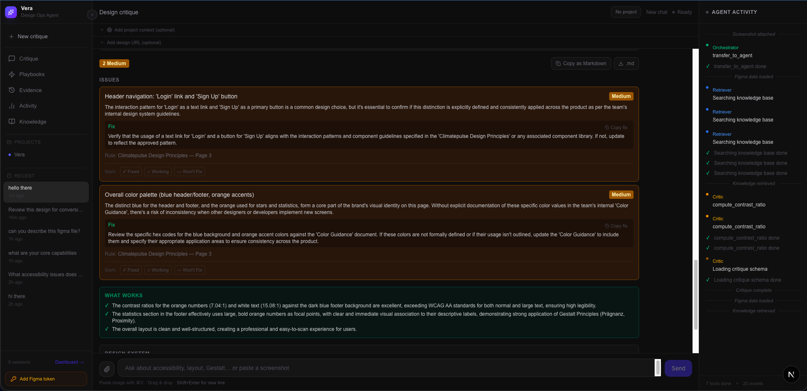
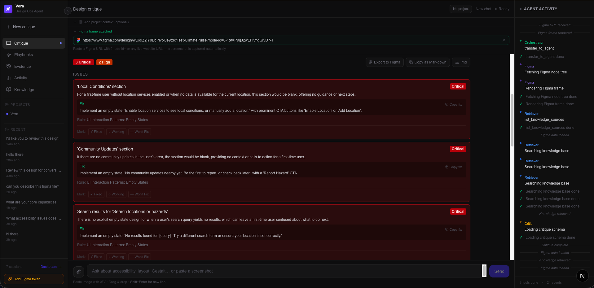
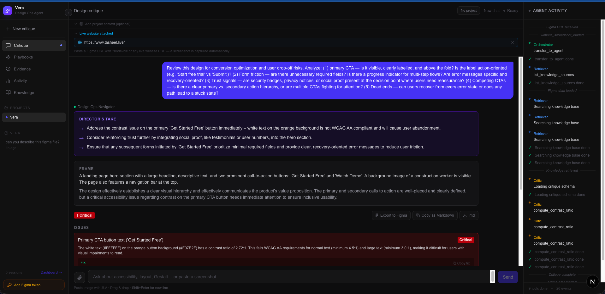
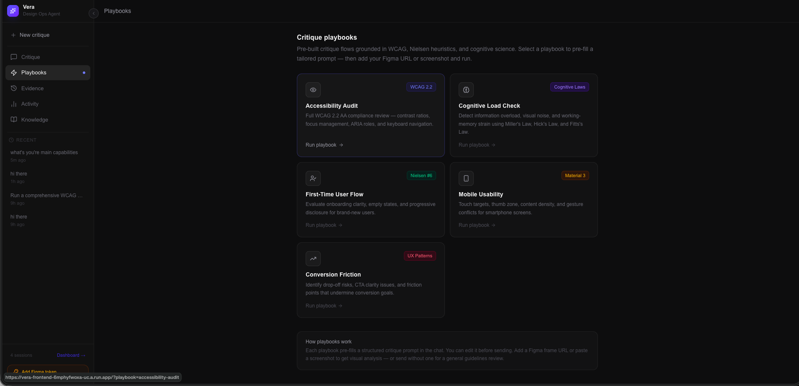
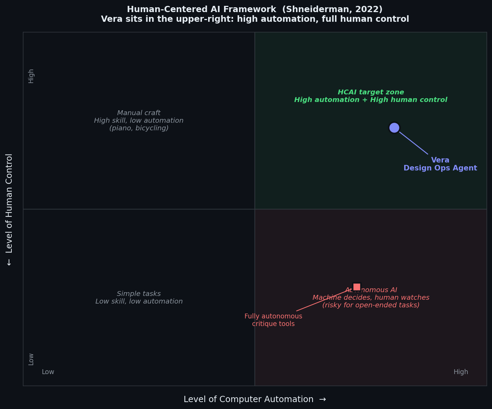
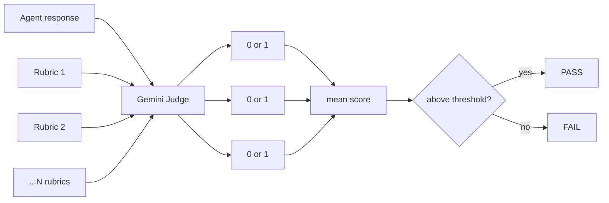
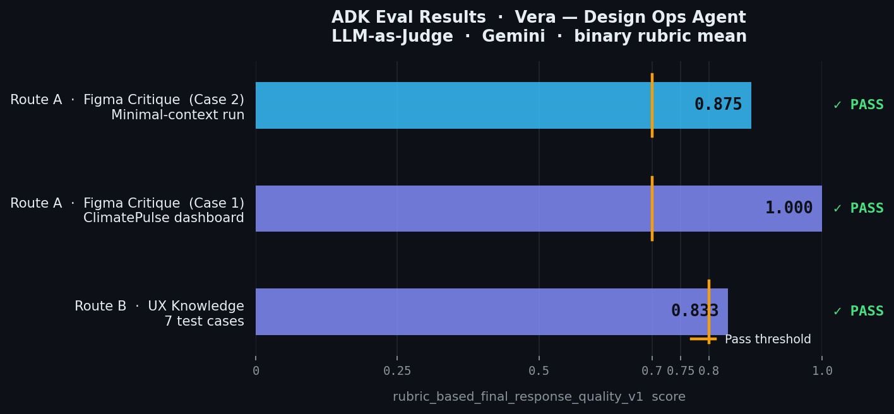
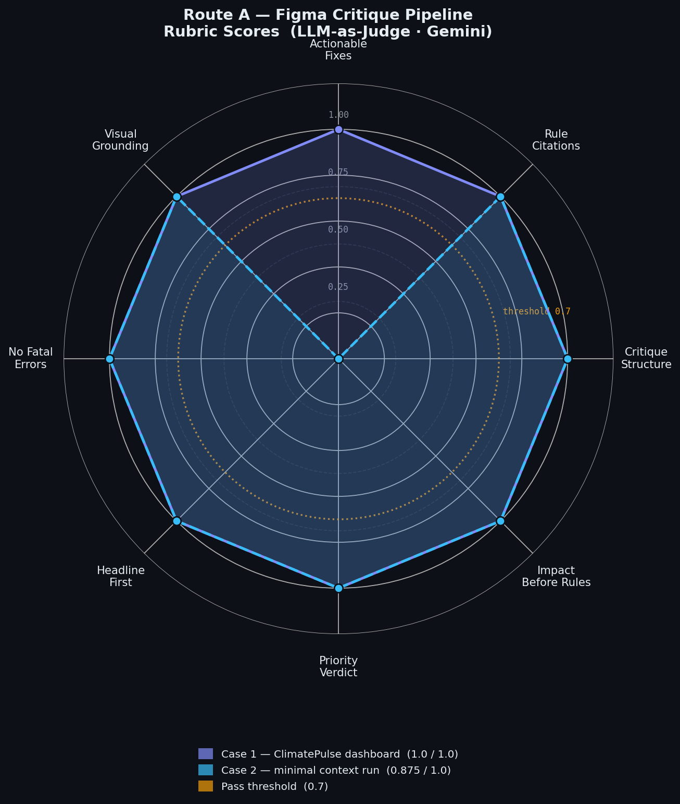

# Vera — Design Ops Agent

**AI-powered UX critique that thinks like a 15-year design director.**

Paste a Figma URL (or any website URL). Vera fetches the design, grounds it in WCAG, Nielsen heuristics, Gestalt principles, and your team's design system — then delivers a structured critique with severity labels, specific fixes, and a clear ship/hold verdict. No vague feedback. No hallucinated rules.

[](https://python.org)
[](https://google.github.io/adk-docs)
[](https://ai.google.dev)
[](https://nextjs.org)
[](https://firebase.google.com)
[](https://cloud.google.com/run)

---

## [→ Try the Live Demo](https://vera-frontend-6mphyfwoxa-uc.a.run.app)

> **Gemini Live Challenge 2026** · Built in 72 hours

---

## What it does

Design reviews are slow, inconsistent, and depend on who happens to be in the room. Vera fixes that.

| Route | Input | What happens |
|-------|-------|-------------|
| **A** | Figma URL | Fetches frame image + node tree → multi-agent critique pipeline |
| **B** | UX question | RAG over WCAG, Nielsen, Gestalt, Cognitive Laws → expert answer |
| **C** | Any website URL | Playwright captures screenshot → same critique pipeline as Route A |
| **D** | "What's in your knowledge base?" | Lists all indexed UX sources |

---

## Screenshots

### Critique in action — severity-ranked findings, grounded in standards



### Paste a Figma URL → get a structured critique in seconds



### The Director's Take — opinion-first, evidence-backed



### Pre-built playbooks — Accessibility Audit, Cognitive Load Check, Mobile Usability & more



---

## Architecture

```
Designer  →  Next.js Frontend  →  FastAPI (Cloud Run)
                                        │
                      ┌─────────────────┼─────────────────┐
                      │                 │                  │
                 Figma PNG         Website PNG        root_agent
                  prefetch          Playwright       gemini-2.5-flash
                                                          │
                                          ┌───────────────┼──────────────┐
                                     Route A/C        Route B       Route D
                                   Figma/Website     UX Question   KB Audit
                                          │               │
                                   critique_pipeline  search_knowledge_base
                                   (SequentialAgent)
                                          │
                              ┌───────────┴────────────┐
                              │   parallel_research     │
                              │   (ParallelAgent)       │
                              │  retriever  figma_fetch │
                              └───────────┬────────────┘
                                          │ retrieved_knowledge + figma_context
                                    critic_agent  ← inline PNG (multimodal)
                                          │ critique_report JSON
                                    self_critic_agent  (8-rule QA check)
                                          │ revision_needed?
                                    critic_revision_agent  (skip if clean)
                                          │
                                    synthesis_agent  →  SSE stream  →  UI
```

Full interactive diagram: see [ARCHITECTURE.md](ARCHITECTURE.md)

### Two-Tier RAG

| Tier | Collection | Model | Contents |
|------|-----------|-------|---------|
| 1 | `ux_knowledge` | `gemini-embedding-001` (768-dim) | WCAG 2.2, Nielsen 10, Gestalt, Cognitive Laws, Material Design 3 |
| 2 | `user_knowledge` | `gemini-embedding-2-preview` (768-dim, multimodal) | Your design system, brand guidelines, component specs |

Retrieval: top-20 fetch → **hybrid BM25 + RRF reranking** → top-5 returned. Exact terminology (WCAG SC numbers, Hick's Law) gets boosted over pure semantic matches.

---

## Design Philosophy

Most AI tools for designers make a quiet assumption: the AI should decide, and the human should accept. Vera is built on the opposite premise — the AI does the heavy lifting of research and pattern-matching, and the designer remains fully in control of what gets acted on.

This maps directly to what Ben Shneiderman calls the **upper-right quadrant** of Human-Centered AI (*Human-Centered AI*, Oxford University Press, 2022): high automation *and* high human control, at the same time — not a trade-off between them.



In practice this means:
- Vera never applies a change. It surfaces findings; the designer decides what ships.
- Every critique cites the specific rule (WCAG 1.4.3, Nielsen #4) and the specific element — not a black-box verdict. You can trace every claim.
- The Issue Status Tracker (Fixed / In Progress / Won't Fix) gives designers a running audit trail of what the team has chosen to act on — and what they've consciously deprioritized.
- By explaining *why* something fails a heuristic, Vera builds the designer's own UX knowledge rather than creating dependency on the tool.

Shneiderman describes this design pattern as a **supertool**: technology that amplifies what a skilled human can do, while the human retains the wheel.

---

### How the critique earns its specificity

The most common failure mode of AI-generated feedback is vagueness. "Improve the contrast" tells a designer nothing actionable. Vera enforces specificity at two levels:

**1. Verifiable checks at parse time** — before any response reaches the user, `compute_contrast_ratio()` computes the actual ratio for every hex pair mentioned in the critique. If the model claims a 2.3:1 ratio and the math says 3.1:1, the claim is suppressed. Fixes that don't include a measurement token (`#hex`, `px`, `rem`, `:1` ratio) are rejected outright. These are deterministic checks — no LLM judgment involved.

**2. A self-critique loop** — after the critic agent produces a first draft, a dedicated `self_critic_agent` checks it against 8 quality rules: Are fixes specific? Does every issue cite a named standard? Is severity accurate? Are there signs of issue inflation or monotone citation (citing the same rule for everything)?

```
critic  →  self_critic  →  revision  →  synthesis
               ↓               ↓
          flags issues     fixes only what's flagged
                           skips entirely if clean
```

If nothing is flagged, the revision step is skipped — no extra LLM call. This is the SELF-REFINE loop (Madaan et al., NeurIPS 2023) applied to critique quality: generate, reflect, revise only when needed.

---

### How retrieval stays accurate

Semantic search alone fails on UX knowledge. A query for "WCAG 1.4.3" returns chunks that *discuss* contrast — but may rank a general accessibility overview above the exact success criterion. Vera uses a hybrid pipeline:

**Dense + lexical fusion (BM25 + RRF)** — vector search captures meaning; BM25 gives exact-term matches (rule numbers, law names, acronyms) a direct boost. Reciprocal Rank Fusion merges both rankings without needing to normalize their scales.

**Diversity filter (MMR)** — if the top-5 chunks are all from the same WCAG section, the critique will repeat the same point five ways. Maximal Marginal Relevance trades a little relevance for coverage across different principles.

**Contextual chunk headers** — each chunk is embedded with a short context prefix ("Source: WCAG 2.2 | Category: Accessibility") so isolated sections don't lose their domain signal. Anthropic's 2024 research on this approach showed a 49% reduction in retrieval failure on vague queries.

**Your team's knowledge (Tier 2)** — if you upload your design system or brand guidelines, they're indexed separately and searched alongside the standard library. The critique becomes specific to your stack, not just generic best practice.

---

### Learning from your team's decisions

Every time a designer marks an issue as Fixed, In Progress, or Won't Fix, that signal is stored. On the next critique for the same workspace, the rules your team consistently acts on surface higher; rules you consistently dismiss surface lower. No labels, no training loop — just the natural signal from your workflow.

This is intentionally lightweight. Cold-start is real: a new workspace gets no personalization until it has usage history. We're not hiding that.

---

### Honest limitations

- **Complex nested Figma frames** can confuse the vision model. If a frame is deeply nested or has overlapping components, the visual analysis may miss elements that are obvious to a human glancing at the design.
- **Contrast ratios are computed from hex values in the node tree**, not from the rendered image. If your design uses gradients, opacity layers, or blended colors, the computed ratio may not match what a user actually sees.
- **The knowledge base is WCAG 2.2**, not WCAG 3.0 (still in draft). Some newer guidance is not represented.
- **Implicit personalization has a cold-start problem** — it only works after a workspace has meaningful usage history.
- **Critique is advisory, not auditable for legal compliance.** Vera's output is a starting point for design review, not a certified accessibility audit.

---

## Eval Results

Vera is evaluated using **Google ADK's rubric-based eval framework** — no cherry-picked demos.

### How it works

Each response is judged by Gemini against atomic binary rubrics (0 or 1 per rubric). The final score is the mean across rubrics. No reference answer required — the judge reads the rubric spec and the agent's output.



### Score overview



### Route B — UX Knowledge (7 test cases, threshold 0.8)

| Metric | Score | Status |
|--------|-------|--------|
| `rubric_based_final_response_quality_v1` | **0.833 / 1.0** | ✅ PASS |

Rubrics: grounded citations · actionable specificity · no hallucination · professional tone · director voice · impact connected — all 7 cases passed.

### Route A — Figma Critique Pipeline (2 test cases, threshold 0.7)



| Rubric | Case 1 | Case 2 |
|--------|--------|--------|
| Critique structure (severity labels, What's Working section) | 1.0 | 1.0 |
| Rule citations (WCAG SC, Nielsen #, Gestalt, Cognitive Laws) | 1.0 | 1.0 |
| Actionable fixes (hex values, contrast ratios, px values) | 1.0 | 0.0 |
| Visual grounding (named specific elements from the design) | 1.0 | 1.0 |
| No fatal errors (pipeline completed successfully) | 1.0 | 1.0 |
| Headline first (leads with most important finding) | 1.0 | 1.0 |
| Priority verdict (ship-blocking vs. post-launch polish) | 1.0 | 1.0 |
| Impact before rules (user consequence before rule citation) | 1.0 | 1.0 |
| **Overall** | **1.0 ✅** | **0.875 ✅** |

> Run it yourself:
> ```bash
> cd design-ops-navigator/backend
> uv run adk eval . tests/eval/evalsets/critique_quality.json --config_file_path tests/eval/eval_config_critique.json --print_detailed_results
> uv run adk eval . tests/eval/evalsets/route_b_quality.json --config_file_path tests/eval/eval_config.json --print_detailed_results
> ```

---

## Quick Start (5 minutes, 5 env vars)

### Prerequisites
- Python 3.12 + [`uv`](https://docs.astral.sh/uv/)
- Node.js 20+
- Figma Personal Access Token
- Google AI Studio API key
- Google Cloud project with Firestore + Cloud Run

### 1. Clone & configure

```bash
git clone <repo>
cp .env.example design-ops-navigator/backend/.env
# Edit backend/.env — fill in 5 variables (see below)
```

### 2. Required env vars

```env
GOOGLE_API_KEY=          # AI Studio key → aistudio.google.com
GOOGLE_CLOUD_PROJECT=    # GCP project ID
FIGMA_ACCESS_TOKEN=      # figma.com → Settings → Security → Personal access tokens
GOOGLE_CLOUD_LOCATION=us-central1
AUTH_REQUIRED=false      # skip Firebase auth for local dev
```

### 3. Ingest the knowledge base

```bash
cd design-ops-navigator/backend
uv run python -m knowledge.ingest --reset
```

### 4. Start backend

```bash
uv run uvicorn server:app --reload
# → http://localhost:8000
```

### 5. Start frontend

```bash
cd design-ops-navigator/frontend
npm install && npm run dev
# → http://localhost:3000
```

Paste a Figma URL and hit **Critique →**

---

## Tech Stack

| Layer | Technology |
|-------|-----------|
| Agent Framework | Google ADK — SequentialAgent, ParallelAgent, Agent |
| LLM | Gemini 2.5 Flash (all 6 agents) |
| Embeddings Tier 1 | `gemini-embedding-001` · 768-dim · RETRIEVAL_DOCUMENT |
| Embeddings Tier 2 | `gemini-embedding-2-preview` · 768-dim · multimodal |
| Vector Store | Firestore Native Vector Search · Flat · COSINE |
| Retrieval | Hybrid BM25 + RRF · MMR reranking |
| Multimodal Vision | Gemini inline PNG (Figma frames, website screenshots) |
| Web Capture | Playwright + Chromium |
| Design API | Figma REST API v1 |
| Server | FastAPI · AG-UI SSE protocol |
| Deployment | Google Cloud Run |
| Frontend | Next.js 15 · React 19 · Tailwind v4 |
| Auth | Firebase Authentication |

---

## How it works (Route A — Figma critique)

1. **URL parsing** — `server.py` extracts `file_key` + `node_id` from the Figma URL
2. **Async prefetch** — Figma PNG is fetched before the ADK runner starts (non-blocking)
3. **Parallel research** — `retriever_agent` runs 3 RAG searches across both tiers; `figma_fetcher_agent` pulls the node tree + style data — both in parallel
4. **Multimodal critique** — `critic_agent` receives the frame PNG as `inline_data`, the node tree as text, and the retrieved UX rules, then produces a structured `CritiqueReport` JSON
5. **Constitutional QA** — `self_critic_agent` checks the report against 8 quality rules (rule citations, severity accuracy, vague directives, etc.); `critic_revision_agent` fixes flagged issues and skips if the report is clean (zero extra LLM cost)
6. **Synthesis** — `synthesis_agent` formats the JSON into a design-director-voice response with severity badges, specific hex fixes, and a ship/hold verdict, then streams it via AG-UI SSE

---

## ADK Agent Hierarchy

```
root_agent (design_ops_navigator)
├── tools: search_knowledge_base, list_knowledge_sources, web_search
└── sub_agents:
    └── critique_pipeline (SequentialAgent)
        ├── parallel_research (ParallelAgent)
        │   ├── retriever_agent
        │   └── figma_fetcher_agent
        ├── critic_agent
        ├── self_critic_agent
        ├── critic_revision_agent
        └── synthesis_agent
```

---

## Project structure

```
design-ops-navigator/
├── backend/
│   ├── agents/          # ADK agent definitions
│   ├── knowledge/       # RAG: ingest, embeddings, sources (.md files)
│   ├── tools/           # ADK tools: figma, rag, critic schema
│   ├── tests/eval/      # ADK eval sets + configs
│   ├── server.py        # FastAPI + AG-UI SSE
│   └── config.py        # pydantic-settings
└── frontend/
    ├── app/
    │   ├── page.tsx              # Main chat + design URL input
    │   ├── components/           # ChatWindow, CritiqueReport, ActivityFeed
    │   ├── hooks/useAgentStream.ts  # SSE consumer
    │   ├── dashboard/            # Activity + impact overview
    │   └── knowledge/            # KB management (upload design system)
    └── next.config.ts   # Security headers (CSP, HSTS, X-Frame-Options)
```

---

## Built for the Gemini Live Challenge

Vera demonstrates what's possible when Gemini 2.5 Flash powers a multi-agent system purpose-built for a professional domain. The agent doesn't just retrieve rules — it reasons about them against a specific design, prioritizes by real user impact, and delivers the kind of critique that usually requires booking 30 minutes with your most senior designer.

The constitutional QA pipeline (self-critic → revision) ensures every output meets the same rubric that human design directors use: specificity, grounded citations, actionable fixes, and a clear verdict.
